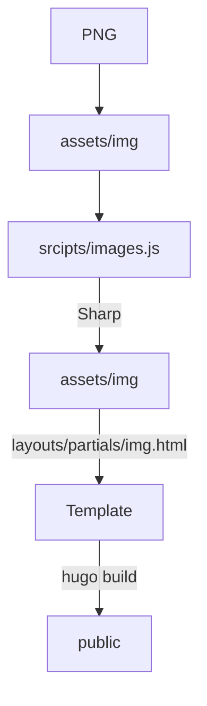
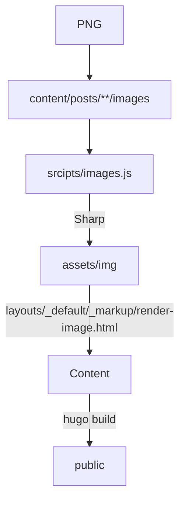

# Ryan Bagley's Blog

## Image Pipeline
Images are processed with the help of [Node Sharp](https://sharp.pixelplumbing.com). There are two flows: **template** images and **markdown** images. All images start as a single **PNG** file, which is then used to generate resized variants.

3 variants are created:
- jpeg
- webp
- avif

The image are then placed inside a `<picture>` tag and loaded with the help of a couple `<source>` tags, followed by an `` tag. The browser will then load the smallest file supported by it's engine.

### Template
These are images used in the HTML templates. Called with the help of the `img.html` partial. Files are accessed from the `/assets/img` directory, following the [Hugo Pipes](https://gohugo.io/hugo-pipes/introduction/) flow.



The partial utilized like so:
```html
{{ partial "img.html" (dict "src" "home.jpeg" "alt" "meadow" "width" "720" "height" "900") }}
```
The partial takes in the following parameters:
- `src`: **required** - Image name. No file path is required, as all images are stored in `/assets/img`.
- `alt`: **required** - Image alt text.
- `width`: **required** - `` width attribute. Max image width size should be used. This prevents layout shift.
- `height`: **optional** - `` height attribute. Auto calculated with ommited.
- `hidden`: **optional** - `` aria-hidden attribute. Used to remove image from screen readers. _Does not remove image from UI._
- `picClasses`: **optional** - `<picture>` custom classes.
- `imgClasses`: **optional** - `` custom classes.

### Markdown
These are images used in content files placed in the `/content/posts` directory.



These are utilized inlined like so:
```md

```

A `width` attribute value is automatically added based on the maximum image width possible based on the parent container.

### Rendered Output
Both flows render the same output:
```html
<picture class="img-wrap">
  <source srcset="/img/home.avif" type="image/avif" />
  <source srcset="/img/home.webp" type="image/webp" />
  
</picture>
```
This ensures the smallest image size is always loaded. On top of that, native lazy loading is utilized to only load images until they are in view.

### Generating Images
The image script runs at build time via npm script. When running `npm run build`, the script runs before Hugo's build command does. If you only run `hugo`, it is possible you will get errors due to missing assets. So using the npm script is always recommended.
