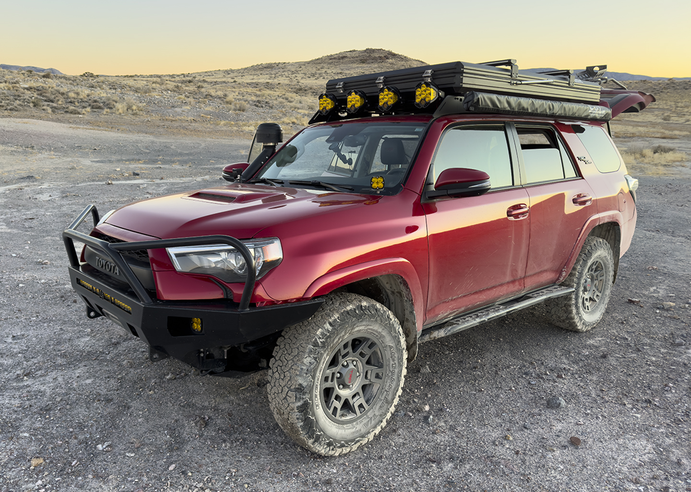
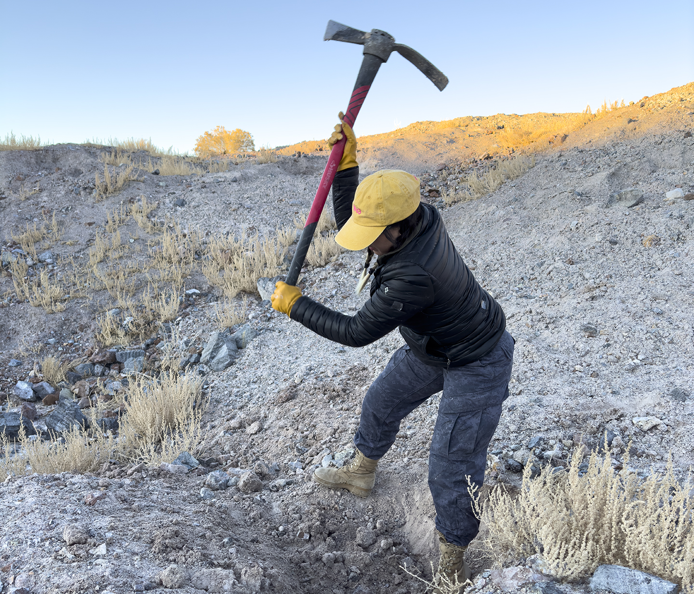
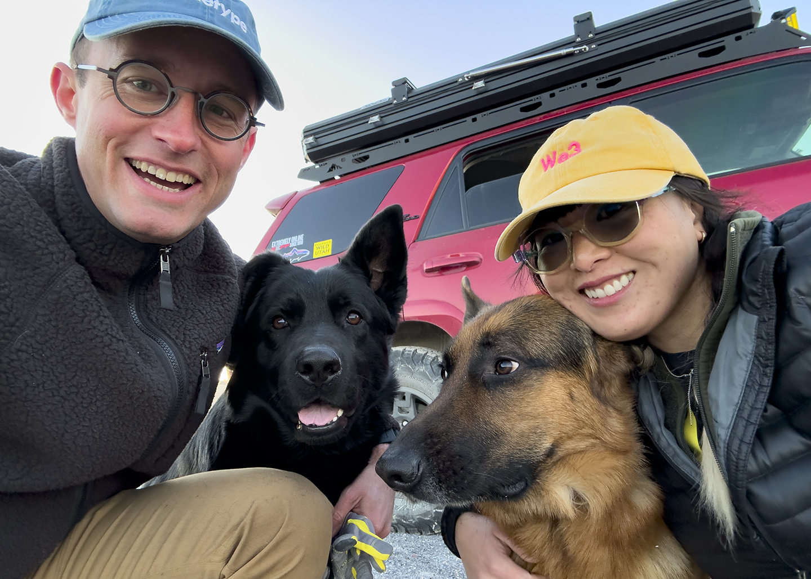
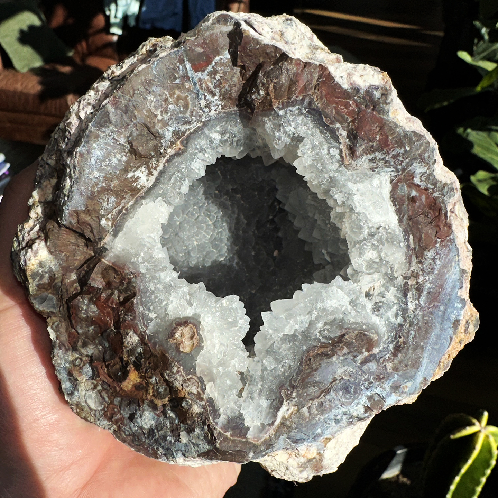

While touring most gift shops in the west you might encounter beautiful hollow rocks with giant crystals inside. In the most general terms these are called geodes. After seeing some locations in Utah where you can dig them up for free I have been planning to go. After seeing enough epically priced geodes in gift shops you begin to wonder if they are just trying to price gouge the tourists or they are in fact, rare. I remember seeing some geodes larger than 5 feet priced at $60,000.

This particular geological expedition was to the [Dugway Geode Beds](https://goo.gl/maps/JaEveW2VYpAwD2ue6) in the Utah West Desert. Managed by the Bureau of Land Management, this federal piece of land is pretty far from any sort of civilization and notorious for chewing up tires on the roads to get there. Since I live in the northern portion of the Salt Lake City metropolitan area my best route was by I-15, I-80, Highway 36, and lastly, Pony Express Road. However, on the way home we instead took Highway 196, which proved pretty quick becuase there were no small towns or traffic lights all the way to I-80.

My sister had visited this spot the year prior and shared that they had gotten a flat tire on the drive out. Well, to be exact, they got the flat while trying to reach Topaz Mountain, which is a little bit to the south. Their vehicle isn't exactly a dedicated for off roading so I wrote off the experience as something I probably wouldn't have to deal with. Well, to place your mind at ease we didn't actually get a flat but we saw the horrors of the potential. Over the course of driving in and out there were 3 abandonded trailers with mangled tires and 2 vehicles with flats. I actually stopped to help one since they needed an impact gun to get off a stubborn bolt. After seeing this wasteland of carnage I considered myself very fortunate to not have gotten a flat.

The Geode Beds themselves are a collection of mounds that cover a few acres. I'm not sure if the BLM excavated the area for visitors or the landscape is simply formed from so many diggers over the years. Without any knowledge of where to start my wife and I just selected a few random spots and started digging. This was pretty idiotic of us but on this particular day we were flying by the seat of our pants and were just excited to be out there.

After digging for about 2 hours we had finally figured out what geodes looked like on the outside and so became a lot more efficient towards the last 30 minutes of excavating. I wonder how much more efficient we could have been if we had done a little geological studying before setting out on this trip. It would have been helpful to know what depth most geodes sit at within the dirt. The landscape has enough contours to start digging at a certain depth if it was needed.

Luckily, in the last 15 minutes or so, we found a sizable mango sized geode. This might have been lucky taking pity on us wasting so much time digging in random places but the geode is big enough to have made the whole trip worth it. Regardless, if we had just come home with the scrap geodes, the experience of the trip was reward enough itself.

Cleaning up the geodes, tools, dogs, and 4Runner afterwards was quite the chore. The clay dirt common in the area ended up being in the same species as cement. My dogs had begun limping towards the end of our stay and on examination it turned out to be the clay collecting in balls between their paws with small stones wedged in. Getting this out wasn't exactly straightforward since the clay had attached itself to their paw's fur so you couldn't pull it directly out. The same situation applied for our digging tools and the 4Runner. I have already visited the car wash a few times and there is still clay caked into my wheel wells despite the direct application of the power washing sprayer nozzle. It'll certainly take a few more car washes to get it all off.