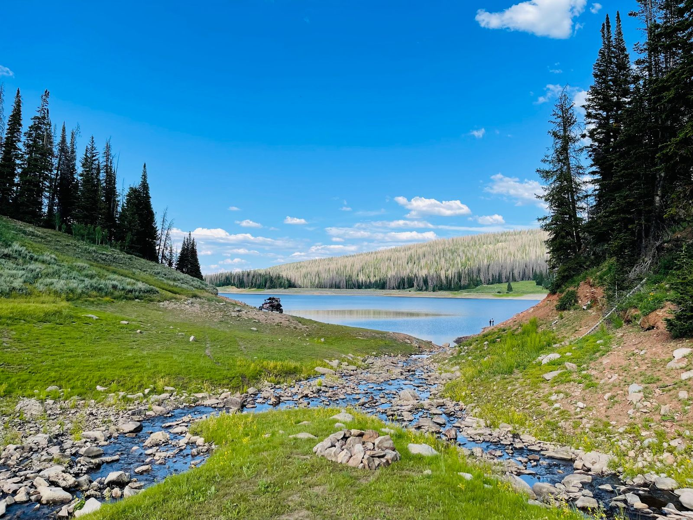

Sometimes you need pleasantly boring. My first camping trip as an adult was certainly not at Whitney Reservoir but it seemed like the first one without any major issues. My first venture into the wilderness as a responsible adult was a backpacking trip into the Grand Canyon wilderness between Glen Canyon Dam and Lee's Ferry. The trip was cut short after experiencing first hand how fast water is consumed in an arid desert. How could I have known the several guide books I read about being careful in the desert were actually true? Our rapid self-extraction from the area had us blazing trail across extremely steep sandstone cliffs, which has been the foundation of distrust my wife has maintained in my ability to read topographical maps. I was convinced the line spacing on the map was enough to indicate a gentle slope upward slope.

I also can't forget our intrepid determination to make it through the muddy North Rim of the Grand Canyon in our station wagon with tires worn down by tens of thousands of miles of driving. While attempting to dig, push, and swear our way through the mud we were passed by a local lodge tour van filled with bemused Japanese tourists eager to see the sunset at the rim of the Grand Canyon. In their attempt go around our stuck station wagon they themselves fell victim to the treacherous mud. I felt extremely vindicated with this result since the van itself was aggressively off-road equipped and had only made it as far as our admirable station wagon. Never mind the fact that we had ejected them from the path of the main road into the soft muddy shoulder. It wasn’t until two hours later that both vehicles were rescued by the lodge caretaker whom had only come out since the tour van never returned. Each experience prior to Whitney Reservoir seemed to be marred by unexpected (*unplanned*) challenges that drastically changed the direction of said trip. Maybe such changes are to be expected and looked forward to as part of the charm of going on adventures. However, my perfectionist obsessive compulsive urges greatly disagree.

To mitigate some of these challenges I adopted a 4x4 vehicle into the family. It has yet to be determined if I simply raised the stakes of potential consequences. With the confidence and capability such a vehicle brings it could take me to areas of the wilderness tens or hundreds of miles away from help or cell service. At least our station wagon kept me from getting too far off the beaten path where I could be stumbled upon by a local lodge van tour. This new capability is always in my mind and I strive to plan trips based this risk assessment and outright fear. Hopefully this judgment call will become more nuanced with experience. Based on all this I decided a very capable trip destination was in order. Herein we arrive at the selection of lovely Whitney Reservoir.

Whitney Reservoir is a man-made lake sitting at an approximate elevation of 9,200 feet in the northern central region of the Uinta-Wasatch-Cache National Forest. The area isn't as eye catching as the Uinta mountain range but provides for a grandiose land area with large expanses for outdoor recreation. Geography in the immediate area is a bit more rolling hills as compared to the flat meadows and pronounced peaks of neighboring places like Christmas Meadows and King’s Peak. Most of the people in area seemed to be semi-local, if not at least regional-local. This gave off a more rugged and homey feel as compared to the easily accessed tourist centric spots in the area next to the highway. Most camps I saw were certainly repeat customers of the area and knew how to comfortably function autonomously in the wild.

Veering west off U. S. Route 150 between the Bear River Ranger Station and Hayden Fork Campground I followed the signs along FR032 for Whitney Reservoir. While Google Maps might guide you on a faster route by utilizing FR081, this would be a mistake as the road is much more rugged and requires a significantly more capable vehicle than the comparatively calm washboards of FR032. While this statement is mostly true I can’t help but remember my own vehicle struggling on FR032. It seems that on an annual or semi-annual basis they re-grade the road during high summer season. I just so happened to chose a day of the week when the road was most chewed up by the Forest Service road grader. What was normally a simple dirt road was transformed into a loose dirt slurry. I was able to get over these segments of fresh road but a few trucks carrying long trailers had to wait until the grader finished its work. No further challenges were to be seen on the road to the reservoir. Several crossroads forked the path along FR032, however, signage was generous and fortunately there was no backtracking required.

Whitney Reservoir itself sits between a few larger treed hills. The rolling terrain is mildly deceptive of the high altitude environment, which starts at approximately 9,200 feet. Residents of sea level cities might feel lethargic or out of breath doing normally easy activities like hiking the surrounding hills. I felt these effects despite my home in Utah being at 4,200 feet. You should also be wary of the rapidly moving isolated thunderstorms that can change summer to winter in short order. It would be best to carry an assortment of gear and clothing suited to a variety of weather conditions even in the middle of summer. You might get the privilege of staying at the four seasons during your trip. Depending on the time of year and previous winter’s snow pack levels will determine the height of the water table. As you can see in my photographs the water was quite low in the summer of 2021 and had been quickly replaced by grasses growing in the rich soil.

While the entire area is formally considered as a dispersed camping area there are many campsites that have been well established. Much of these are clustered on mainly the north and west portions of the reservoir. I would highly recommend using an existing site as it is much better for the ecology of an area to reuse locations rather than trailblazing and disturbing new sections. I arrived in the area towards the late afternoon and subsequently got a poor choice of sites with others being occupied. Fortunately, I located a site with some minor tree coverage and which was close to the water.

To get an idea of the area around my chosen camp site I usually take a stroll before setting everything up. This helps avoid situations you might find problematic. For instance, you wouldn't want to setup camp next to an extremely steep ravine if you have a small child. Or you might even find all that separates you and the next camp is a single thin bush. It is certainly wise to just get a bearing of your area since the easy view from your vehicle might not reveal all the dirty secrets. In the course of my own walkabout I saw a large group of Jeeps had gathered in the camp next to mine and on the other side was an older couple who appeared to have been setup for a week or more. Not a bad combination despite getting a poor choice of sites.

After setting up camp I quickly found out exactly how much dirt a dog can fit on its body. Well, not exactly to the gram, but maybe within a few pounds. The area I had chosen was entirely bare dirt and my dogs fully embraced it. I think by the time I had finished setting up the tent they had dug a few holes, ran around the 4Runner several hundred times, and rolled around to their heart's content. Within the span of perhaps thirty minutes they had transformed from well manicured house dwelling man's best friend to filthy hell hounds. Both of them certainly knew it and gave me that knowing eyeballing after plopping down in the dirt despite their elevated nylon beds being just a few feet away.

Night comes soon when you start the day in the late afternoon. I tried my best to dust off my dear fur-balls before letting them in the tent but they were still filthy. I had to embrace it. I am certainly known for babying my dogs but I do it without guilt. With everyone settled down we tried to ship off to the land of dreams but kept getting yanked back. The nightlife sounds are pretty different from the suburbs to the high Uinta wilderness. The dogs couldn't settle down with each new scary unknown animal making itself acoustically known. The suburbs also seemed to have followed us into the forest as the coolness of the evening revealed a raucous party across the reservoir. I do remember the phenomenon of sound traveling across bodies of water with the cool evening air. But such facts had been out of my head since Boy Scout camp twenty years prior.

I have to pause here to reflect on the type of people you encounter in an outdoor wilderness type situation. In a generalized sense, it seems that your perceived level nature-lovingness is inversely proportionate to the distance away from civilization you find yourself recreating. To provide an example you could take the party crowd that travels a short distance away from wherever to setup shop and blow off steam. It is a great idea since if you did this same stunt in a city park you might get cited for public intoxication or similar. Moving along the spectrum we find groups that go just a bit farther but seemingly blow off steam by simply being outdoors and relaxing rather than bringing the entire karaoke sound system. There are definitely exceptions to this but I'm trying to generalize here so just hold off on that angry email. Finally, we arrive at people reaching the farthest distances away from society. Here I am picturing backpackers or homesteaders who appreciate nature itself as an integral part of their life besides just an area to relax. Based on this self-made spectrum of outdoorsyness I was rather confused about the presence of this party across the water. This location was several hours away from any major metropolitan area. However, this could be my city slicker mind making assumptions about the recreation habits of people in nearby small towns, which could spell disaster for my established people modeling matrix. Another theory is that these were indeed party goers from the big city and attacked the established spectrum by driving three hours for that prime time party location. The only thing I do know for certain is that I was incredibly lucky for the music to last to the responsible time of three in the morning.

Morning is always the best and the worst. Late nights bring heavy baggage that pull you back into sleep. Those bags can get incredibly heavy with chronic sleep loss or maybe just a single night of noisy neighbors. Yet there is the magic of sunrise, which is emphatically better than sunset simply because you sacrificed precious sleep. Couple this with a hot cup of coffee and a dog at your side make for what I previously dubbed as magical. Those kind of moments define trips. All the stupid shit up to that point shifts a bit into an amiable memory and suddenly becomes entirely worth the hassle to experience this moment. I see this process similar to climbing a mountain. The process is a grind, physically, and mentally. Waking up at some evil hour in order to summit at time XX:XX combined with the hours and hours of hiking to accomplish such a feat. However, once at the top it all seems worth it, even despite realizing you are only half way done.

Following this enriching morning I walked the dogs along the reservoir shore and had another epiphany. If you combine extremely dirty dogs and water together things can in fact get even worse. By worse I mean that the previously powdered dirt transforms into numerous layers of caked mud. By then I had given up hope completely and reassured myself that their eighty pound frames could only accommodate so much raw mud.
